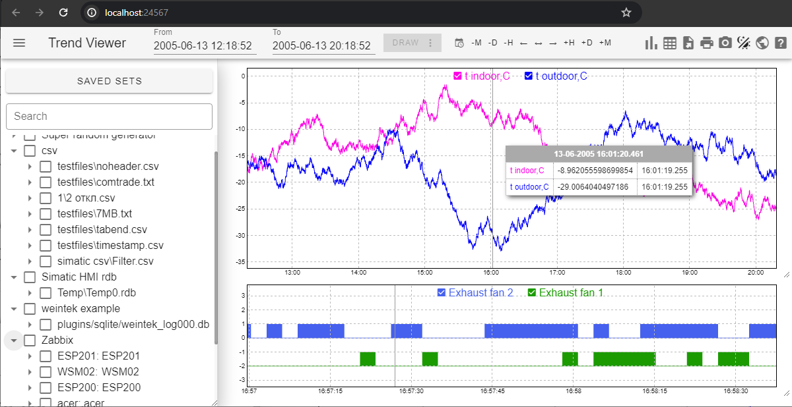

# Trend Viewer

**Trend Viewer** is a program designed for quick trend visualization from various data sources.

- **Backend**: Powered by Python to handle data retrieval and processing.
- **Frontend**: Runs in the browser for easy, platform-independent access.

## Features

 - View data from CSV, SQLite, Simatic HMI RDB files, Weintek DB files, Citect SCADA, Zabbix, MasterSCADA 4D SQLite.
 - Some sources use native DLL functions, which are not included in the archive, as these types of data sources are uncommon. If needed, you can write them yourself, as...
 - Easily add custom data sources using Python. You can even write a plugin that queries archives from the device via Modbus and displays them.
 - Portable. No installation required. Works on both Windows and Linux.
 - Includes essential trend analysis features that are often missing in SCADA systems.
 - Интерфейс на русском языке.

## Installation

1. Download the archive.
2. Run `run.bat` on Windows or `run.sh` on Linux.
3. Open the web interface in your browser.
4. Edit `server.py` according to your needs and use it.

## License

This program is free for both personal and commercial use and is licensed under the MIT License.

THE SOFTWARE IS PROVIDED "AS IS", WITHOUT WARRANTY OF ANY KIND, EXPRESS OR IMPLIED, INCLUDING BUT NOT LIMITED TO THE WARRANTIES OF MERCHANTABILITY, FITNESS FOR A PARTICULAR PURPOSE AND NONINFRINGEMENT. IN NO EVENT SHALL THE AUTHORS OR COPYRIGHT HOLDERS BE LIABLE FOR ANY CLAIM, DAMAGES OR OTHER LIABILITY, WHETHER IN AN ACTION OF CONTRACT, TORT OR OTHERWISE, ARISING FROM, OUT OF OR IN CONNECTION WITH THE SOFTWARE OR THE USE OR OTHER DEALINGS IN THE SOFTWARE.

This program uses the following libraries:

- **D3.js v3.5.16** - [https://d3js.org](https://d3js.org)
- **TWGL v4.21.2** - [https://twgljs.org](https://twgljs.org)
- **Vue.js v2.6.14** - [https://v2.vuejs.org](https://v2.vuejs.org)
- **Vuetify v2.7.2** - [https://v2.vuetifyjs.com](https://v2.vuetifyjs.com)
- **html2canvas 1.4.1** - <https://html2canvas.hertzen.com>

## Contact Information

This project was created by an engineer with experience in Industrial Automation Engineering.

For questions or suggestions, you can contact the author via email: `xabrs@outlook.com`

If you use it for commercial purposes, you are welcome to support the author. Donations are highly appreciated and will help further the development of the project.

- **TON**: `UQCYWVLvVk6IG5FXlCU4TA-r5EF4rXvgHJinPDPZrr4JbleV`
- **BTC**: `1NJ1ZrZr95bAgBcXRe98kU71gyEgXmBagH`

